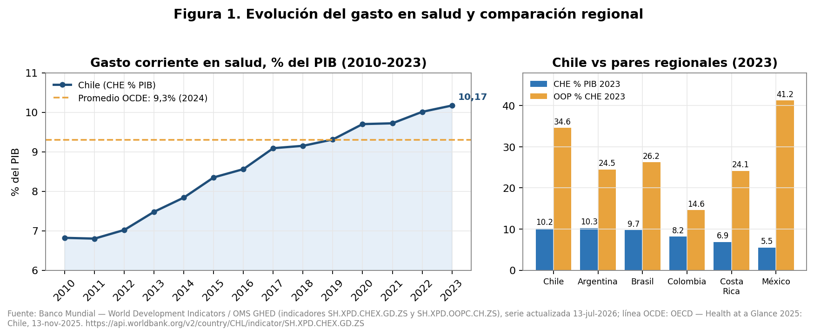
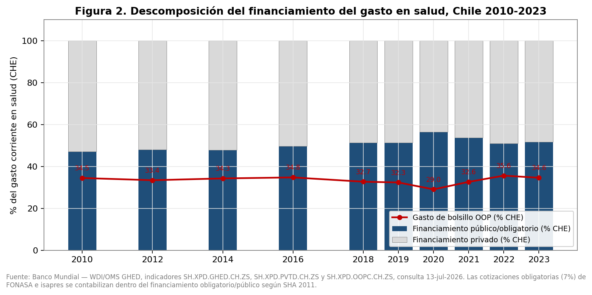
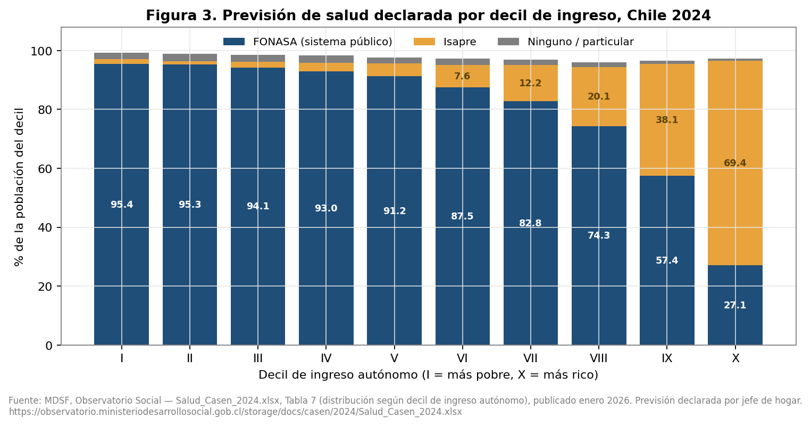
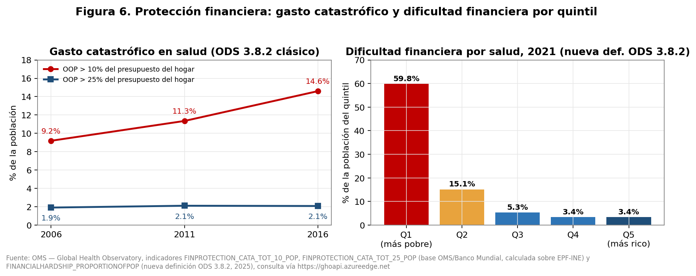
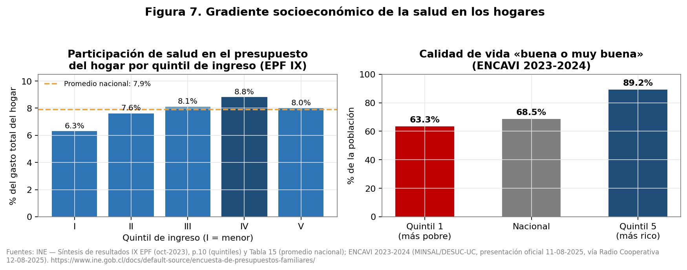
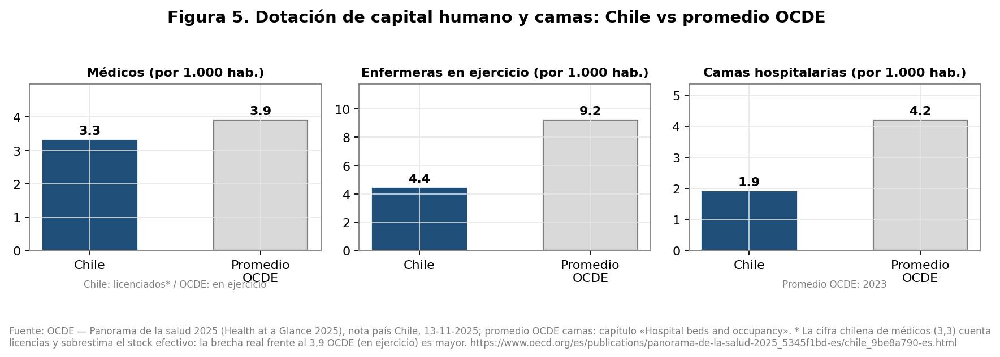

# Monitor Socioeconómico de la Salud en Chile
## Informe analítico con verificación de fuentes primarias

**Fecha de elaboración:** julio de 2026
**Cobertura temporal de los datos:** 2010–2026 según indicador
**Regla de evidencia:** todas las cifras de este informe provienen de la verificación de fuentes primarias documentada en `fuentes/M1_M5_financiamiento.md`, `fuentes/M2_M3_aseguramiento_listas.md` y `fuentes/M4_M6_M7_carga_capital_demografia.md`. Cada indicador declara su definición, universo e instrumento. Los datos no verificados se declaran explícitamente como **NO VERIFICADO**; no se rellena con conocimiento externo.

> **Nota de nomenclatura (jul-2026):** el «Índice de Presión Sanitaria (IPS)» que este informe propone se publica en el dashboard bajo el nombre **Termómetro de la Salud**, renombrado para evitar confusión con el Instituto de Previsión Social. Este documento conserva la denominación original por su valor de registro; la especificación vigente y simplificada (5 componentes) está en `README.md` y `js/core.js`.

---

# Resumen ejecutivo

Chile presenta una paradoja sanitaria bien delimitada por los datos verificados: gasta más que nunca y más que el promedio de la OCDE en términos relativos, pero convierte ese esfuerzo en resultados desiguales y en presión directa sobre los hogares y sobre la red pública.

**Financiamiento.** El gasto corriente en salud chileno pasó de 6,82% del PIB en 2010 a **10,17% en 2023** (OMS GHED vía Banco Mundial), y la nota país de la OCDE reporta **10,5% del PIB y USD 3.749 PPA per cápita** (~2024), por sobre el promedio OCDE de 9,3% del PIB, aunque con un gasto per cápita muy inferior (USD 5.967 PPA en el promedio OCDE). El presupuesto público de la partida MINSAL creció 90% nominal entre la ley inicial 2019 y la ley 2026 (9,06 → 17,25 billones CLP, DIPRES vía BCN). Pese a ello, la estructura del financiamiento sigue siendo anómala: solo **59% del gasto está cubierto por prepago obligatorio** (vs. 75% promedio OCDE) y el gasto de bolsillo representa **34,6% del gasto total** (2023), segundo más alto de la región tras México.

**Aseguramiento.** La CASEN 2024 (publicada en enero de 2026) confirma la recomposición del sistema: **FONASA cubre al 82,6% de la población** (récord de la serie desde 2006) y las isapres al 13,2%, tras perder 786 mil afiliados entre dic-2019 y dic-2024 (−23,5%) y ~840 mil acumulados a 2025. La segmentación por ingreso es extrema: el 69,4% del decil X declara isapre y el 95,4% del decil I está en FONASA. La afiliación, además, no garantiza atención oportuna: el 34,2% de quienes se atendieron declara haber tenido problemas para obtener atención (37,4% en FONASA vs. 16,4% en isapre).

**Listas de espera.** Al cierre de 2025 hay **2.889.833 registros en espera** en la red pública (2.464.738 consultas nuevas de especialidad y **425.095 intervenciones quirúrgicas**, cifra que corrige las ~422.556 del brief original). Las medianas de espera mejoraron (226 días CNE y 251 días IQ, las más bajas de la serie), pero las **garantías GES retrasadas crecen sin pausa**: 78.594 al cierre de 2025, desde 54.333 en 2021. En 2023 fallecieron 35.492 personas estando en lista (1,6% de las personas en lista), con la advertencia metodológica del propio MINSAL de que no cabe inferir causalidad.

**Carga de enfermedad.** El 63,9% de la población tiene al menos una enfermedad crónica y el 40,1% multimorbilidad (ENCAVI 2023-2024). La obesidad medida es 31,2% y la hipertensión 27,6% (ENS 2016-2017, la última disponible: un vacío de medición en sí mismo). El 19% reporta depresión, ansiedad u otro trastorno de salud mental.

**Protección financiera.** El gasto catastrófico (>10% del presupuesto del hogar) subió de 9,2% (2006) a **14,6% (2016)**; con la nueva definición ODS 3.8.2, el **17,4% de la población tenía dificultad financiera por salud en 2021, llegando a 59,8% en el quintil más pobre**. Los medicamentos concentran 36-38% del gasto de bolsillo y ~80% del gasto en medicamentos retail se financia de bolsillo.

**Capacidad y demografía.** Chile tiene 4,4 enfermeras por mil habitantes (OCDE: 9,2) y 1,9 camas por mil (OCDE: 4,2). El envejecimiento es la fuerza de fondo: desde **2028 habrá más personas de 65+ que menores de 15** y los 65+ pasarán de 13,5% a 18,9% de la población hacia 2035 (INE, proyecciones base 2024).

**Síntesis cuantitativa.** El informe propone un **Índice de Presión Sanitaria (IPS)** de 0 a 100. Con los datos verificados disponibles, el IPS actual de Chile es **60,7 — nivel ALTO**, impulsado principalmente por el déficit de enfermería, el gasto de bolsillo y las dificultades efectivas de acceso.

**Correcciones al brief original** (todas documentadas en los archivos de verificación): el GES cubre **90 problemas de salud desde el 1-dic-2025** (no 87); las intervenciones quirúrgicas en espera al cierre de 2025 son **425.095 registros** (no 422.556); las garantías GES retrasadas son **78.594 al cierre de 2025** (no ~77 mil); el rango de OOP es **29,0%–35,6%** (no 33–38%); la obesidad oficial medida es **31,2%** (no 34%); la tasa de suicidio bruta es **11/100.000** (10,7 es la ajustada por edad); el "8,8% de inmigrantes sin previsión CASEN 2024" es **NO VERIFICADO** (la referencia verificada es CASEN 2013: 8,9%).

---

# Módulo 1 — Financiamiento y gasto

## 1.1 Gasto total en salud: nivel, tendencia y comparación internacional

**Definición y universo.** El gasto corriente en salud (*current health expenditure*, CHE) sigue la metodología de Cuentas de Salud SHA 2011: mide los bienes y servicios de salud consumidos en el año, excluye inversión de capital. Las series provienen de la base GHED de la OMS (replicada en los World Development Indicators del Banco Mundial) y de OECD Health Statistics.

**Hallazgo central.** Chile más que duplicó su esfuerzo relativo en 13 años: de 6,82% del PIB en 2010 a **10,17% en 2023** [Banco Mundial — WDI/GHED, SH.XPD.CHEX.GD.ZS, 13-jul-2026]. La OCDE, con su propio corte (~2024), reporta **10,5% del PIB y USD 3.749 PPA per cápita**, sobre el promedio OCDE de 9,3% del PIB pero muy por debajo del promedio per cápita OCDE de USD 5.967 PPA [OECD — *Health at a Glance 2025: Chile*, 13-nov-2025]. La cobertura poblacional para un set básico de servicios alcanza 97% [misma fuente].

**Tabla 1.1 — Serie del gasto corriente en salud, Chile (% del PIB)**
*Fuente: Banco Mundial — WDI/OMS GHED, indicador SH.XPD.CHEX.GD.ZS, actualización 13-jul-2026.*

| Año | CHE % PIB | Año | CHE % PIB |
|-----|-----------|-----|-----------|
| 2010 | 6,82 | 2017 | 9,09 |
| 2011 | 6,80 | 2018 | 9,15 |
| 2012 | 7,02 | 2019 | 9,31 |
| 2013 | 7,48 | 2020 | 9,70 |
| 2014 | 7,84 | 2021 | 9,72 |
| 2015 | 8,35 | 2022 | 10,01 |
| 2016 | 8,56 | 2023 | 10,17 |

El gasto per cápita PPA (GHED) pasó de USD 2.384 (2019) a **USD 3.337 (2023)**; el componente público per cápita fue USD 1.722 PPA en 2023 [Banco Mundial — WDI/GHED, SH.XPD.CHEX.PP.CD y SH.XPD.GHED.PP.CD, 13-jul-2026].

**Tabla 1.2 — Comparación con pares regionales, 2023**
*Fuente: Banco Mundial — WDI/GHED vía API, 13-jul-2026.*

| País | CHE % PIB | OOP % CHE |
|------|-----------|-----------|
| Chile | **10,17** | **34,59** |
| Argentina | 10,27 | 24,47 |
| Brasil | 9,73 | 26,23 |
| Colombia | 8,16 | 14,63 |
| Costa Rica | 6,87 | 24,13 |
| México | 5,50 | 41,24 |

Chile es, junto a Argentina, el mayor gastador relativo al PIB del grupo, y concentra el segundo gasto de bolsillo más alto tras México: la anomalía chilena no es cuánto gasta, sino quién paga.

## 1.2 Descomposición del financiamiento

**Definición.** GHED clasifica por fuente: "domestic general government health expenditure" (GGHE-D: ingresos fiscales más contribuciones obligatorias) y "domestic private" (hogares, seguros voluntarios, empresas). En el caso chileno, **las cotizaciones obligatorias del 7% — tanto de FONASA como de isapre — se contabilizan dentro del financiamiento obligatorio/público** en SHA 2011, por lo que "público" en esta tabla no equivale a "FONASA".

**Tabla 1.3 — Estructura del financiamiento del CHE, Chile (%)**
*Fuente: Banco Mundial — WDI/GHED, SH.XPD.GHED.CH.ZS, SH.XPD.PVTD.CH.ZS y SH.XPD.OOPC.CH.ZS, 13-jul-2026.*

| Año | Público % CHE | Privado % CHE | OOP % CHE |
|-----|---------------|---------------|-----------|
| 2010 | 47,10 | 52,89 | 34,47 |
| 2014 | 47,74 | 52,26 | 34,27 |
| 2018 | 51,24 | 48,76 | 32,70 |
| 2020 | 56,51 | 43,49 | 29,04 |
| 2022 | 50,88 | 49,12 | 35,60 |
| 2023 | **51,61** | **48,39** | **34,59** |

La pandemia elevó transitoriamente la participación pública (56,5% en 2020), pero el sistema revirtió a una estructura casi paritaria. Solo **59% del gasto está cubierto por prepago obligatorio, frente a 75% en el promedio OCDE** [OECD — *Health at a Glance 2025: Chile*, 13-nov-2025].

**NO VERIFICADO:** el desglose FONASA+aporte fiscal vs. cotizaciones isapre dentro del esquema obligatorio (GHED a nivel de esquemas HF.1.1 vs. HF.1.2 no fue accesible; requiere descarga completa del GHED o cuentas de salud MINSAL/DEIS).

## 1.3 Presupuesto público de salud (partida 16, MINSAL)

**Definición y universo.** Partida 16 del Presupuesto de la Nación (subsecretarías, FONASA, ISP, CENABAST, Servicios de Salud). Valores en billones (10^12) de CLP nominales. "Ley inicial" es la ley aprobada; "ejecutado" es el gasto devengado a diciembre.

**Tabla 1.4 — Presupuesto de la Nación, partida 16 Ministerio de Salud (billones CLP)**
*Fuente: BCN — Presupuesto de la Nación, API api-presupuesto (numeroPartida=16; datos DIPRES), consulta en sesión; interfaz: https://www.bcn.cl/presupuesto/periodo/2025/partida/16.*

| Año | Ley inicial | Vigente dic. | Ejecutado dic. |
|-----|-------------|--------------|----------------|
| 2019 | 9,06 | 10,47 | 10,52 |
| 2020 | 9,99 | 12,41 | 12,30 |
| 2021 | 9,95 | 14,25 | 14,05 |
| 2022 | 11,85 | 14,63 | 14,67 |
| 2023 | 12,80 | 15,54 | 15,88 |
| 2024 | 14,68 | 16,81 | 17,21 |
| 2025 | 16,04 | 18,75 | 19,34 |
| 2026 | 17,25 | — | — |

El presupuesto de ley inicial creció **+90% nominal entre 2019 y 2026**; el ejecutado, +84% entre 2019 y 2025. La ley 2025 sufrió además un recorte de ~$16 mil millones durante el año [Tirant Prime, 17-ene-2025]. **NO VERIFICADO:** la evolución real per cápita (requiere deflactor y población; no calculada para no introducir supuestos).

**Nota metodológica del módulo.** Las cifras OCDE (~2024) y GHED (2023) no son contradictorias: corresponden a años y cosechas distintas. En todo el informe se cita siempre la fuente con su año de referencia.

---

# Módulo 2 — Aseguramiento y segmentación

## 2.1 La recomposición del aseguramiento: CASEN 2024

**Definición y universo.** La Encuesta CASEN (MDSF) es una encuesta transversal a hogares; su universo es la población residente en viviendas particulares, con expansión nacional. La previsión de salud es **declarada** por el jefe de hogar para cada integrante — no es registro administrativo — por lo que sus porcentajes difieren de los registros de FONASA/Superintendencia. Los resultados de CASEN 2024 fueron presentados el **8 de enero de 2026** (postergados desde agosto de 2025 por la nueva metodología de medición de pobreza) [MDSF — Observatorio Social, https://observatorio.ministeriodesarrollosocial.gob.cl/encuesta-casen-2024].

**Tabla 2.1 — Distribución de la población según sistema previsional de salud (nacional, %)**
*Fuente: MDSF — Salud_Casen_2024.xlsx, Tabla 1, enero 2026.*

| Sistema | 2017 | 2020 | 2022 | 2024 |
|---|---|---|---|---|
| FONASA | 77,1 | 75,6 | 78,9 | **82,6** |
| Isapre | 15,1 | 16,3 | 15,3 | **13,2** |
| FF.AA. y del Orden | 2,1 | 1,7 | 1,7 | 1,8 |
| Ninguno (particular) | 3,0 | 4,3 | 3,0 | **2,0** |
| Otro / no sabe | 2,6 | 2,0 | 1,1 | 0,5 |

Tres hitos simultáneos: FONASA alcanza su máximo de la serie desde 2006; "sin previsión" toca su mínimo histórico (2,0%); y la isapre cae a 13,2%.

**Tabla 2.2 — Previsión de salud por decil de ingreso autónomo, 2024 (%)**
*Fuente: MDSF — Salud_Casen_2024.xlsx, Tabla 7, enero 2026.*

| Decil | FONASA | Isapre | Ninguno |
|---|---|---|---|
| I | 95,4 | 1,7 | 2,1 |
| II | 95,3 | 1,1 | 2,5 |
| III | 94,1 | 2,1 | 2,4 |
| IV | 93,0 | 2,8 | 2,5 |
| V | 91,2 | 4,4 | 2,1 |
| VI | 87,5 | 7,6 | 2,1 |
| VII | 82,8 | 12,2 | 1,9 |
| VIII | 74,3 | 20,1 | 1,6 |
| IX | 57,4 | 38,1 | 1,0 |
| X | 27,1 | **69,4** | 0,8 |

El gradiente es la fotografía más nítida de la segmentación chilena: el sistema público cubre a más de nueve de cada diez personas hasta el sexto decil, mientras la isapre es mayoritaria solo en el decil más rico. **Corrección/confirmación del brief:** el supuesto "~69% del decil 10 en isapres" es correcto (69,4%; en 2022 era 73,1%).

## 2.2 Crisis de isapres y Ley Corta (Ley 21.674)

La crisis tiene origen judicial: en noviembre de 2022 la Corte Suprema dejó sin efecto las tablas de factores propias de las isapres y ordenó regirse por la Tabla de Factores Única (Circular IF/N°343, 2019), con restitución de lo cobrado en exceso [BCN ATP — *Restitución de excedentes de las Isapres*, dic-2024]. La **Ley 21.674** (publicada 24-05-2024) impuso Planes de Pago y Ajuste, con devolución en hasta 13 años y prima extraordinaria [BCN — Balance Legislativo, ficha Ley 21.674].

**Magnitud verificada de la deuda:** 696.768 contratos; **30.246.766 UF** totales; promedio 43,41 UF (~$1.660.346) por contrato [BCN ATP N°SUP 143.861, dic-2024, con valores de la Superintendencia de Salud].

**Migración verificada:**
- Dic-2019 → dic-2024: las isapres perdieron **786 mil afiliados (−23,5%)**, con 59 meses consecutivos de baja; 2023 fue récord de salidas (360.876 beneficiarios) [La Tercera con datos Superintendencia, vía Radio U. de Chile, 20-02-2025 — *prensa citando al regulador*].
- Dic-2024: ~2,6 millones de beneficiarios isapre (12,7% de la población) [Clínicas de Chile A.G. — *Dimensionamiento 2024*, dic-2025, con datos FONASA/Superintendencia — *gremial citando fuentes oficiales*].
- En 2024 FONASA sumó **522.291 nuevos beneficiarios (+3,2%)**, cerrando con **16.752.189**; 162.262 provinieron de isapres [FONASA vía Diario Usach, ene-2025 — *prensa citando a FONASA*].
- En 2025 el sistema isapre perdió otros **40.403 contratos netos**; al cierre de 2025 quedan ~2,53 millones de beneficiarios y la caída quinquenal llega a ~840 mil [Emol con datos Superintendencia, 04-02-2026 — *prensa citando al regulador*].

**Precios:** bajo el proceso de Adecuación de Precios Base (Ley 21.350), el tope de alza fue **7,4% (2024), 3,7% (2025) y 3,5% (2026)** [Superintendencia de Salud, Res. Exentas SS/N°196/2024, N°229/2025 y N°294/2026 rectificada por N°329].

**NO VERIFICADO:** el número exacto de cotizantes (sin cargas) desde el boletín estadístico de la Superintendencia (portal no accesible en la sesión); las cifras de beneficiarios provienen de prensa/gremial citando al regulador, lo que se declara en cada cita.

## 2.3 Tramos FONASA y cobertura efectiva

FONASA clasifica a sus beneficiarios en cuatro tramos por ingreso imponible del cotizante (cotización legal 7%). Desde **septiembre de 2022 rige Copago Cero en la red pública (MAI) para los cuatro tramos** [FONASA — "Tramos", https://www.fonasa.cl/sites/fonasa/tramos]. Distribución a dic-2025: tramo A 17,9% (3.058.341), B 40,9% (6.996.569), C 14,8% (2.535.630) y D 26,4% (4.505.064); total 17.095.604 beneficiarios [MINSAL — *Glosa 06 IV-2025*, Tabla 10].

**Cobertura nominal vs. efectiva (CASEN 2024):** de quienes declararon un problema de salud en los últimos 3 meses, el **92,1% recibió atención** (2022: 90,0%); pero el **34,2% de quienes se atendieron declara haber tenido algún problema para obtenerla** (~1,2 millones de personas), con brecha previsional marcada: **FONASA 37,4% vs. isapre 16,4%** [MDSF — Salud_Casen_2024.xlsx, Tablas 22, 34 y 43]. La existencia de 2,9 millones de registros en lista No GES y 78.594 garantías GES retrasadas (Módulo 3) es la evidencia registro-basada de esa misma brecha.

**Nota metodológica del módulo.** Las diferencias entre CASEN (declarada) y registros administrativos (FONASA reporta ~17,1 millones de beneficiarios) no son errores: miden cosas distintas. El informe usa CASEN para estructura social del aseguramiento y registros para stocks administrativos, citando cada instrumento.

---

# Módulo 3 — Listas de espera

## 3.1 Definiciones y universo

- **Lista de espera No GES (SIGTE):** registro administrativo de solicitudes de consultas nuevas de especialidad (CNE) e intervenciones quirúrgicas (IQ) electivas en la red pública de los 29 Servicios de Salud. **Registros ≠ personas** (una persona puede tener varias derivaciones; en 2024 el promedio era 1,14-1,20 registros por persona). Excluye urgencias.
- **Garantías GES retrasadas (SIGGES/FONASA):** garantías de oportunidad no cumplidas en plazo y aún no atendidas al corte.
- **Defunciones en lista (DEIS):** cruce SIGTE–Hechos Vitales por RUN; cifras preliminares hasta el cierre del año estadístico.

## 3.2 Niveles y serie

**Tabla 3.1 — Lista de espera No GES: niveles verificados**
*Fuentes: MINSAL — Informes Glosa 06 IV-2024 (Oficio CP N°2169/2025) e IV-2025 (publicado 10-02-2026).*

| Indicador | dic-2024 | dic-2025 |
|---|---|---|
| Registros totales | 2.991.313 | 2.889.833 |
| CNE (registros) | 2.601.084 | 2.464.738 |
| CNE (personas) | — | 2.047.191 |
| IQ (registros) | 390.229 | **425.095** |
| IQ (personas) | — | 371.907 |
| Personas totales en lista | 2.508.227 | (no reportado por traslape) |
| Mediana CNE (días) | 263 | **226** |
| Mediana IQ (días) | 294 | **251** |

**Correcciones al brief:** (i) las IQ al cierre de 2025 son **425.095 registros / 371.907 personas**, no 422.556; (ii) el "~2,6 millones de casos de consultas" corresponde a registros dic-2024; en personas únicas la CNE es 2.047.191 al cierre de 2025; (iii) en 2025 el MINSAL dejó de reportar el total único de personas CNE+IQ por traslape.

**Tabla 3.2 — Medianas de espera (días)**
*Fuentes: MINSAL Glosa 06 IV-2024 e IV-2025; BCN ATP ago-2024 (dic-2023 y jun-2024).*

| Indicador | 2021 | dic-2023 | jun-2024 | dic-2024 | dic-2025 |
|---|---|---|---|---|---|
| CNE | 547 | 240 | 255 | 263 | **226** |
| IQ | 661 | — | 305 | 294 | **251** |

Las medianas de 2025 son las más bajas observadas desde la creación del registro (CNE) y desde 2019 (IQ). En 2025 egresaron de las listas **2.747.514 personas (3.811.218 registros)**, con 80,3% de egresos por atención efectivamente realizada [MINSAL — Glosa 06 IV-2025, Resumen Ejecutivo y Tabla 22]. La **meta oficial** es mediana <200 días hacia 2026: al cierre de 2025 la cumplen 14 Servicios de Salud en CNE y 7 en IQ (rango territorial: 92 días en Aconcagua a 378 en Metropolitano Norte) [BCN ATP, abr-2025; Glosa 06 IV-2025].

## 3.3 Garantías GES retrasadas

**Tabla 3.3 — Garantías GES de oportunidad (cierre de cada año)**
*Fuente: MINSAL — Glosa 06 IV-2025, Tabla 1 (SIGGES-FONASA, extracción 10-01-2026).*

| Año | Retrasadas | Cumplimiento nacional | Total procesadas |
|---|---|---|---|
| 2021 | 54.333 | 97,76% | 3.077.760 |
| 2022 | 61.191 | 97,95% | 3.949.739 |
| 2023 | 70.440 | 97,95% | 4.588.848 |
| 2024 | 77.107 | 97,90% | 5.022.669 |
| 2025 | **78.594** (76.719 personas) | 98,01% | 5.477.932 |

**Corrección al brief:** el "~77 mil" corresponde al cierre de 2024; al cierre de 2025 son **78.594**. Aunque el cumplimiento porcentual mejora (98,01%), el stock absoluto de retrasos crece cuatro años seguidos (+44,7% desde 2021). Composición 2025: 64,9% corresponde al tramo B de FONASA y 80,9% se concentra en el nivel terciario; las cinco condiciones con más personas retrasadas (diabetes tipo 2: 11.743; cataratas: 9.387; hipoacusia 65+: 6.066; vicios de refracción 65+: 6.041; retinopatía diabética: 5.909) suman ~51% del total — un patrón dominado por condiciones de envejecimiento y enfermedad crónica [MINSAL — Glosa 06 IV-2025, Tablas 2-4].

## 3.4 Fallecidos en lista de espera

**Tabla 3.4 — Personas fallecidas estando en lista No GES**
*Fuentes: MINSAL — Glosa 06 IV-2024, sección 7 y Tabla 33; Glosa 06 IV-2025, Tabla 22.*

| Año | Personas | Observación |
|---|---|---|
| 2023 | **35.492** | 1,6% de las 2.197.364 personas en lista; definitivo |
| 2024 | 33.928 | preliminar |
| 2025 | 35.326 | preliminar (cierre estadístico 31-03-2026) |

Perfil 2023: 53,3% hombres; 37,1% con 80+ años; causas principales: tumores (30,6%), circulatorias (22,4%) y respiratorias (12,5%). De quienes fallecieron por cáncer, 92,7% tenía al menos un GES activado. **Advertencia metodológica obligatoria (del propio MINSAL):** la medición identifica personas que fallecieron *estando* en lista; **no establece causalidad** entre espera y muerte — en el análisis de garantías cerradas por fallecimiento (2023), el 84,2% correspondía a problemas de salud no asociados a la causa de defunción.

## 3.5 Vacíos de medición (verificados en BCN, abril 2025)

1. Los **procedimientos y exámenes diagnósticos no están en las estadísticas públicas** de listas de espera: "los tiempos de espera en este ámbito quedan fuera del escrutinio" público y legislativo.
2. Los **controles de pacientes ya conocidos por la especialidad** tampoco se capturan (crítico en quimioterapias y crónicos).
3. La métrica chilena publicada es "tiempo de espera de quienes **permanecen** en lista al corte", no la de pacientes tratados en el período; la OCDE recomienda diferenciar ambas.
4. No hay desagregación por etnia ni situación migratoria (SIGGES/SIGTE no los contemplan como campos obligatorios).

[Fuente: BCN ATP N°SUP 144651 — *Medición y Reportes de la Lista de Espera No GES*, abril 2025.]

**Nota metodológica del módulo.** La coexistencia de medianas en baja y stocks altos no es contradictoria: refleja mayor capacidad de resolución (2,7 millones de egresos en 2025) frente a un flujo de ingreso aún mayor, y el cambio de reporte de "personas" a "registros" impide una comparación de stocks 2024→2025 perfectamente simétrica.

---

# Módulo 4 — Carga de enfermedad y salud mental

## 4.1 Mortalidad

**Definición y universo.** Defunciones registradas según causa básica de muerte (CIE-10, grandes grupos), INE/DEIS. **Corrección al brief:** el último año con causas definitivas es **2022** (Anuario publicado en marzo de 2025); 2023 solo tiene totales provisionales sin desglose CIE-10 publicado en la nota consultada.

**Tabla 4.1 — Mortalidad general y principales causas**
*Fuente: INE — Estadísticas Vitales 2022 y Boletín provisional 2023, 17-03-2025.*

| Indicador | Valor | Año |
|---|---|---|
| Total defunciones | 136.972 (−0,5% i.a.) | 2022 |
| Total defunciones | 121.975 (−10,9% i.a.) | 2023 (provisional) |
| Enfermedades del sistema circulatorio | 33.503 (24,5%) | 2022 |
| Tumores | 29.931 (21,9%) | 2022 |
| COVID-19 | 13.433 (9,8%) | 2022 |
| Tasa de mortalidad infantil | 5,9 por mil N.V. | 2022 |
| Tasa de mortalidad infantil | 6,6 por mil N.V. (provisional) | 2023 |
| Mortalidad prevenible | 151 /100.000 (OCDE: 145) | Panorama 2025 |
| Mortalidad tratable | 78 /100.000 (OCDE: 77) | Panorama 2025 |

Las tasas de mortalidad prevenible y tratable — métricas OCDE del desempeño del sistema — están en el nivel del promedio OCDE [OCDE — Panorama de la salud 2025, nota Chile, 13-11-2025].

## 4.2 Crónicas y multimorbilidad (ENCAVI 2023-2024)

**Definición y universo.** IV Encuesta Nacional de Calidad de Vida y Salud (Depto. de Epidemiología MINSAL; terreno DESUC-UC): 16.590 personas entrevistadas entre octubre de 2023 y febrero de 2024; representatividad nacional, regional, NSE, sexo y rural/urbano; resultados presentados el 11-08-2025.

- **63,9%** de la población tiene al menos una enfermedad crónica; **40,1%** tiene dos o más (multimorbilidad) [presentación oficial vía Radio Cooperativa, 12-08-2025; respaldo OPS, 12-08-2025].
- Obesidad medida (IMC ≥ 30): **31,2%**; hipertensión arterial: **27,6%** (IC95% 25,7–29,7) [ENS 2016-2017, informes INTA-UC y EPI-MINSAL]. **Corrección al brief:** obesidad oficial medida = 31,2% (no 34%); HTA = 27,6%. Advertencia estructural: la ENS 2016-2017 sigue siendo la última medición antropométrica nacional — casi una década sin actualización del principal insumo epidemiológico.

## 4.3 Salud mental

- **19%** de la población reporta depresión, ansiedad u otro trastorno de salud mental (ENCAVI 2023-2024); "1 de cada 4 personas reporta síntomas asociados a depresión o ansiedad" (métrica de síntomas, DESUC) [Cooperativa y DESUC-UC, 11-12-08-2025].
- Bienestar emocional: bajó de 5,7 a 5,4 puntos (escala 1-7) vs. 2015-2016; soledad frecuente: sube de 7,6% a **11,5%**.
- Suicidio: **11 muertes por 100.000 (tasa bruta), igual al promedio OCDE**; 10,7/100.000 es la tasa ajustada por edad [OCDE Panorama 2025; LyD TP-1716]. **Corrección al brief:** el "10,7" del brief es la tasa ajustada; la bruta es 11.
- **NO VERIFICADO:** brecha tratamiento vs. prevalencia en salud mental (no se encontró cifra oficial reciente).

## 4.4 Factores de riesgo y gradiente socioeconómico

**Tabla 4.2 — Factores de riesgo: tres definiciones que no deben mezclarse**
*Fuentes: ENCAVI 2023-2024 (Cooperativa/DESUC, ago-2025); OCDE Panorama 2025 (13-11-2025).*

| Factor | Cifra | Definición |
|---|---|---|
| Tabaquismo | 27,9% | consumo último mes (ENCAVI) |
| Tabaquismo | 16,0% (OCDE: 14,8%) | fumador diario (OCDE) |
| Inactividad física | 51,2% | inactivos físicamente (ENCAVI; mujeres 57,6%) |
| Inactividad física | 33% | "no realiza actividad física" (DESUC) |
| Actividad insuficiente | 40% (OCDE: 30%) | definición OMS en adultos (OCDE) |
| Alcohol | ~40% | consumo último mes (ENCAVI/DESUC) |

**Gradiente socioeconómico verificado:** calidad de vida "buena o muy buena" = 68,5% nacional, pero **63,3% en el quintil 1 vs. 89,2% en el quintil 5** (ENCAVI 2023-2024). ~40% califica su estado de salud como regular o malo (DESUC). Ver Figura 7 en el Módulo 5.

## 4.5 Producción hospitalaria

Los egresos hospitalarios enero–octubre de 2025 superan en 19% a 2021, 11% a 2022, 3% a 2023 y 2% a 2024, pero siguen **6% bajo octubre de 2019** pre-pandemia [MINSAL — *Seis Prioridades Estratégicas 2022-2026*, Tabla 8, DEIS, extracción 25-11-2025]. **NO VERIFICADO:** el total anual absoluto de egresos (series 2022-2024).

**Nota metodológica del módulo.** La ENCAVI reemplaza funcionalmente a la ENS en varios dominios, pero sus cifras son autoreporte; cuando el informe usa obesidad e hipertensión "medidas", la fuente es ENS 2016-2017. Las cifras de ENCAVI provienen de la cobertura periodística de la presentación oficial y de DESUC (la nota MINSAL no fue accesible); se recomienda reemplazar por el informe PDF oficial cuando esté disponible.

---

# Módulo 5 — Gasto de bolsillo y protección financiera

## 5.1 Nivel y composición del gasto de bolsillo

**Corrección al brief:** el rango "33–38%" es aproximado. La serie GHED 2010-2023 verificada va de **29,0% (2020, mínimo pandémico) a 35,6% (2022)**, con **34,6% en 2023** — nunca llega a 38% [Banco Mundial — WDI/GHED, SH.XPD.OOPC.CH.ZS, 13-jul-2026]. Aun así, Chile está entre los más altos de la OCDE (el promedio de prepago obligatorio de 75% implica un OOP típico de ~18-20%).

**Composición — los medicamentos como componente dominante:**
- El gasto farmacéutico es **36% del gasto de bolsillo total de los hogares** (55% entre hogares que compran medicamentos) [OECD — *Policy actions: affordable and accessible pharmaceuticals* (Chile), con OECD Health Statistics 2019/CEP sobre EPF-INE].
- VIII EPF (INE, 2016-2017): 53,4% de los hogares gasta en medicamentos; para quienes compran, son **55,3% de su gasto de bolsillo en salud**; en el agregado, **38% del gasto de bolsillo total** [OCEC-UDP (2021) citando VIII EPF INE].
- **~80% del gasto en medicamentos retail se financia de bolsillo** (en la OCDE, ~40% con recursos privados) [CIF Chile, oct-2025, citando Health at a Glance 2019].

**NO VERIFICADO:** la figura de desglose del OOP por tipo de servicio de *Health at a Glance 2025* para Chile (el country note no la incluye).

## 5.2 Gasto catastrófico y dificultad financiera (ODS 3.8.2)

**Definición.** Porcentaje de la población cuyo gasto de bolsillo en salud supera el 10% (o 25%) del presupuesto del hogar (metodología OMS/Banco Mundial; en Chile se calcula sobre la EPF del INE).

**Tabla 5.1 — Gasto catastrófico en salud, Chile**
*Fuente: OMS — Global Health Observatory, FINPROTECTION_CATA_TOT_10_POP y FINPROTECTION_CATA_TOT_25_POP.*

| Año (EPF) | >10% del presupuesto | >25% del presupuesto |
|---|---|---|
| 2006 | 9,19% | 1,91% |
| 2011 | 11,35% | 2,11% |
| 2016 | **14,60%** | **2,08%** |

El hallazgo clave: la incidencia al umbral del 10% **aumentó** entre 2006 y 2016, en contra de la narrativa de protección creciente. Con la **nueva definición ODS 3.8.2 (2025)** de "dificultad financiera" (gasto que empobrece o supera la capacidad de pago) [P4H Network, 15-may-2025], Chile registra:

- **2021: 17,38% de la población con dificultad financiera por salud** (componente empobrecimiento: 11,36%; gasto grande: 6,02%). Serie: 1996: 18,7% · 2006: 12,6% · 2011: 14,8% · 2016: 15,9% · 2021: 17,4% [OMS — GHO, FINANCIALHARDSHIP_PROPORTIONOFPOP].
- **Gradiente 2021 por quintil de riqueza: Q1 59,8% · Q2 15,1% · Q3 5,3% · Q4 3,4% · Q5 3,4%** — el indicador con mayor pendiente distributiva de todo el Monitor.

## 5.3 El gasto en salud de los hogares (IX EPF)

**Definición y universo.** IX Encuesta de Presupuestos Familiares (INE, oct-2021 a sep-2022): 15.134 hogares, 79 comunas; representativa de capitales regionales y conurbaciones (urbano); división CCIF 06 "Salud".

- Gasto promedio mensual en salud: **$115.283 (IC95%: 110.237–120.329), 7,9% del gasto total del hogar** [INE — Informe IX EPF, Tabla 15]. El aumento vs. VIII EPF (deflactada) no es estadísticamente significativo [Tabla 18].
- **Por quintil de ingreso, participación de salud en el presupuesto:** I: 6,3% · II: 7,6% · III: 8,1% · IV: 8,8% · V: 8,0% [INE — Síntesis IX EPF, p.10].
- Por macrozona: Norte $89.217 (6,7%) · Gran Santiago $129.555 (8,1%) · Centro $98.034 (7,8%) · Sur $104.693 (8,4%) [INE — Síntesis IX EPF].
- **NO VERIFICADO:** descomposición interna de la división salud por quintil en la IX EPF (medicamentos/consultas/exámenes/seguros); requiere tabulados detallados.

## 5.4 Instituciones de protección financiera

- **GES/AUGE — CORRECCIÓN MAYOR AL BRIEF:** desde el **1 de diciembre de 2025 el GES cubre 90 problemas de salud** (no 87), por el Decreto GES N°29 (Diario Oficial 28-11-2025), que incorpora cirrosis hepática post-alta, depresión grave hospitalaria en menores de 15 años y cesación de tabaco en 25+, con inversión adicional de **$100.740 millones anuales** [LeyChile/BCN — Decreto 29 MINSAL; Servicio de Salud Magallanes, 01-12-2025].
- **Ley Ricarte Soto (20.850):** protección para diagnósticos y tratamientos de alto costo para beneficiarios de todos los sistemas; **27 enfermedades** según ficha ChileAtiende (ene-2023), con ampliaciones por decreto de ene-2025 (esclerosis múltiple, artritis reumatoide). **NO VERIFICADO:** el número vigente 2026.
- **Copago Cero FONASA:** confirmado para los cuatro tramos en la red pública desde septiembre de 2022 [FONASA].
- **CAEC: NO VERIFICADO** el detalle de coberturas vigentes.

## 5.5 Deuda de hogares por causas médicas

La EFH 2024 (Banco Central, presentada 30-09-2025: 4.649 hogares, expansión a 6,7 millones) muestra que los hogares con alguna deuda bajaron de 66% (2017) a 51% (2024). **NO VERIFICADO:** no existe un tabulado oficial publicado de "deuda por tratamiento médico/salud" en la EFH; es un vacío de medición prioritario para el Monitor (alternativa sugerida: módulo de endeudamiento CASEN).

**Nota metodológica del módulo.** Coexisten dos instrumentos de protección financiera con lógicas distintas: ODS 3.8.2 clásico (presupuesto del hogar, EPF) y la nueva definición 2025 (capacidad de pago y empobrecimiento). No son intercambiables; el informe los reporta por separado y con su año de encuesta.

---

# Módulo 6 — Capital humano y capacidad

## 6.1 Dotación: Chile vs. OCDE

**Tabla 6.1 — Recursos del sistema: Chile vs. promedio OCDE**
*Fuente: OCDE — Panorama de la salud 2025, nota país Chile, 13-11-2025 (promedio camas: capítulo "Hospital beds and occupancy").*

| Indicador | Chile | OCDE | Definición |
|---|---|---|---|
| Médicos | 3,3 /1.000 hab. | 3,9 /1.000 | Chile: **con licencia**; OCDE: en ejercicio |
| Médicos especialistas | 1,73 /1.000 hab. | — | 5° más bajo de la OCDE (2024) |
| Enfermeras | **4,4 /1.000 hab.** | **9,2 /1.000** | en ejercicio (comparable) |
| Camas hospitalarias | **1,9 /1.000 hab.** | 4,2 /1.000 (2023) | total camas |
| Farmacéuticos | 72 /100.000 | 86 /100.000 | — |

**Corrección/advertencia metodológica confirmada:** el 3,3 de médicos chilenos cuenta **licencias** y sobrestima el stock efectivo; frente al 3,9 OCDE (en ejercicio), **la brecha real de médicos es mayor de lo que sugiere la comparación directa**. En cambio, enfermeras y camas sí son comparables — y allí el déficit es estructural: Chile tiene menos de la mitad de enfermeras y de camas por habitante que el promedio OCDE. El déficit de enfermería es, cuantitativamente, el mayor déficit de capacidad relativo del sistema.

## 6.2 Distribución y remuneraciones

- **Brecha territorial: NO VERIFICADO con dato oficial reciente.** Solo se verificaron referencias antiguas: tasas entre 117 y 212 médicos por 100.000 hab. según región (Banco Mundial–SSRA, 2010, vía UC Políticas Públicas 2011) y la estimación INDH 2016 de que ~50% de los médicos atiende al sector privado (2 millones de personas) y ~50% al público (15 millones).
- **Remuneraciones:** el médico general chileno gana en promedio **2,6 veces** el salario del trabajador promedio y el especialista **4,4 veces** — segundo mayor premio salarial de la OCDE tras Hungría; enfermeras, tercer mayor premio relativo [LyD SIE-332, feb-2025 y TP-1716, nov-2025, citando datos OCDE — *centro de estudios citando OCDE*]. Lectura analítica: el sistema paga caro en el tope de la escala y tiene déficit masivo en la base (enfermería), una estructura de incentivos coherente con listas de espera de especialidad.

## 6.3 Compras a privados y telemedicina

**NO VERIFICADO.** No se encontró cifra oficial vigente sobre convenios/compras a prestadores privados (Glosa 06/Contraloría) ni sobre volumen de telemedicina post-pandemia en el sector público. El único dato relacionado: el 80,3% de egresos de listas en 2025 fue por atención efectiva, "incluye resolutividad, telemedicina, Hospital Digital, extrasistema" [MINSAL — Glosa 06 IV-2025] — es decir, el extrasistema y la telemedicina ya son parte de la capacidad de resolución, pero sin desagregación pública.

---

# Módulo 7 — Demografía y contexto macro

## 7.1 Envejecimiento y proyecciones (INE, base 2024)

**Fuente principal:** INE, Estimaciones y Proyecciones de Población base 2024 (con asesoría CELADE-CEPAL), publicadas 28-01-2026.

**Tabla 7.1 — Hitos demográficos verificados**
*Fuente: INE — EEPP base 2024, 28-01-2026; complemento: proyecciones base Censo 2017 citadas por CEPS-UDD, jul-2024.*

| Indicador | Valor |
|---|---|
| Población 2026 | 20.150.948 (junio) |
| Máximo histórico | 20.643.490 en 2035; decrece desde 2036 |
| Menores de 15 años | 29,3% (1992) → **16,3% (2026)** → 7,2% (2070) |
| Cruce 65+ > <15 | **desde 2028** |
| Población 65+ | 13,5% actual → **18,9% en 2035** → 24,8% en 2050 → 42,6% en 2070 |
| Población 15-64 | cae desde 2035 |
| Tasa global de fecundidad | 1,06 (2024) → 0,92 (2026), bajo reemplazo todo el período |
| Esperanza de vida proyectada 2026 | 81,8 años (79,5 hombres; 84,3 mujeres) |

**Razón de dependencia numérica: NO VERIFICADO** como cifra oficial; se verificó cualitativamente el cruce 2028 y la caída de la población en edad de trabajar desde 2035.

## 7.2 Esperanza de vida

**Tabla 7.2 — Esperanza de vida al nacer**
*Fuentes: INE Estadísticas Vitales (17-03-2025); INE EEPP 2024 (28-01-2026); OCDE Panorama 2025 (13-11-2025).*

| Fuente | Valor | Año |
|---|---|---|
| INE | 79,72 | 2022 |
| INE (provisional) | **81,39** | 2023 |
| INE EEPP (proyección) | 81,8 | 2026 |
| OCDE | **81,6** (OCDE: 81,1; Chile +0,5) | 2023 |

Trayectoria: caída pandémica de −1,71 años (2021: 79,14) y recuperación de +2,25 años entre 2021 y 2023. Chile ya vive más que el promedio OCDE con menor gasto per cápita — pero con más años por vivir en condiciones de multimorbilidad (40,1%, Módulo 4). **Brechas territoriales de esperanza de vida: NO VERIFICADO.**

## 7.3 Inmigración y salud

- Stock: **1.918.583 personas extranjeras residentes** al 31-12-2023 (+4,5% anual); Venezuela 38,0%, Perú 13,6%, Colombia 10,9%, Haití 9,8%, Bolivia 9,4% [INE-SERMIG, 30-12-2024]. Censo 2024: ~1,61 millones de personas migrantes (2017: 784.685) [Servicio Jesuita a Migrantes citando INE, jul-2025].
- **CORRECCIÓN al brief:** el "8,8% de inmigrantes sin previsión CASEN 2024" es **NO VERIFICADO y probablemente erróneo** — la CASEN 2024 publicó resultados recién desde enero de 2026 y el módulo comparable no está difundido. La referencia verificada es **CASEN 2013: 8,9%** de inmigrantes sin previsión (vs. 2,5% local) [Cabieses et al.].

## 7.4 Precios de la salud

- IPC general: +3,5% anual a diciembre de 2025; +2,8% a 12 meses en enero de 2026 [INE, 08-01-2026 y 06-02-2026].
- IPC división Salud: **7,7% a 12 meses en noviembre de 2023**; +1,2% mensual en enero de 2026 (entre las divisiones con mayor alza del mes) [Boletín INE citado por APROB, ene-2024; INE vía Xinhua, feb-2026]. **PARCIAL:** la serie anual completa IPC-salud vs. IPC-general no quedó verificada.
- Precios base isapre (APB, Superintendencia): topes de alza 7,4% (2024), 3,7% (2025) y 3,5% (2026) — ver Módulo 2.

## 7.5 Contexto fiscal

Chile gasta 10,5% del PIB en salud (>9,3% OCDE) [OCDE Panorama 2025]. Referencia OCDE: el gasto sanitario concentra en promedio 15% del gasto público en la OCDE (2024) [OCDE — comunicado, 13-11-2025]. **NO VERIFICADO:** el % específico de Chile del gasto público total (DIPRES). El presupuesto sectorial 2024 fue de $14.464.864 millones [USS Políticas Públicas con datos DIPRES, oct-2023].

**Nota metodológica del módulo.** Las proyecciones de población 65+ combinan dos bases: el cruce 2028 y los hitos de fecundidad/esperanza de vida provienen de la base 2024 (la más reciente); la trayectoria 13,5%→18,9%→24,8% proviene de la serie base Censo 2017 citada en documento técnico MINSAL-UDD. Se declara la base en cada uso.

---

# Valor agregado analítico

## A. Lecturas transversales que emergen de la verificación

1. **La paradoja del esfuerzo.** Chile ya gasta como país OCDE en términos relativos (10,5% del PIB) pero con per cápita de economía emergente (USD 3.337–3.749 PPA) y con una estructura de financiamiento atípica: casi la mitad del gasto es privado y más de un tercio sale directamente del bolsillo de los hogares. El problema dominante no es el nivel de gasto sino su arquitectura.
2. **La doble cola del sistema público.** FONASA crece a récord (82,6% CASEN; 17,1 millones de beneficiarios administrativos) al mismo tiempo que sus listas de espera concentran 2,9 millones de registros y sus garantías retrasadas crecen cuatro años seguidos. La universalización nominal del aseguramiento público convive con racionamiento por espera.
3. **El gradiente socioeconómico atraviesa todos los módulos.** Es el mismo patrón en cinco instrumentos distintos: previsión por decil (CASEN), dificultad financiera por quintil (OMS, 59,8% vs. 3,4%), calidad de vida por quintil (ENCAVI, 63,3% vs. 89,2%), problemas de acceso por previsión (37,4% vs. 16,4%) y concentración de retrasos GES en el tramo B (64,9%).
4. **La demanda futura ya es visible.** El cruce 65+ > <15 en 2028, la multimorbilidad de 40,1% y la composición de los retrasos GES (cataratas, hipoacusia, retinopatía, diabetes: condiciones de envejecimiento) muestran que la presión no es coyuntural.

## B. Propuesta metodológica: Índice de Presión Sanitaria (IPS)

**Objeto.** Sintetizar en un único número (0–100) la presión efectiva que el sistema sanitario traslada a la población: dificultad de acceso oportuno, exposición financiera, déficit de capacidad y resultados evitables. Mayor valor = mayor presión.

**Componentes y normalización.** Cada componente se normaliza min-max a escala 0–100 con anclajes explícitos derivados de estándares internacionales o de la propia serie chilena:

`valor_normalizado = (x − min) / (max − min) × 100` (para déficits se invierte el eje).

| # | Componente (dimensión) | Indicador y dato actual | Anclajes min→max | Valor 0-100 | Ponderación | Estado |
|---|---|---|---|---|---|---|
| C1 | Acceso — consulta especialidad | Mediana CNE: **226 días** (dic-2025) | 0 → 365 días | 61,9 | 15% | dato real |
| C2 | Acceso — cirugía | Mediana IQ: **251 días** (dic-2025) | 0 → 365 días | 68,8 | 10% | dato real |
| C3 | Garantías incumplidas | GES retrasadas / procesadas: **1,43%** (2025) | 0% → 5% | 28,7 | 10% | dato real |
| C4 | Fricción de acceso | Problemas para obtener atención: **34,2%** (CASEN 2024) | 0% → 50% | 68,4 | 10% | dato real |
| C5 | Exposición financiera | OOP % CHE: **34,6%** (2023) | 10% → 45% | 70,3 | 15% | dato real |
| C6 | Empobrecimiento por salud | Dificultad financiera: **17,4%** (2021, ODS 3.8.2 nuevo) | 0% → 30% | 58,0 | 10% | dato real |
| C7 | Capacidad — enfermería | 4,4 vs. 9,2 enfermeras/1.000 (déficit invertido) | 9,2 → 2,0 por mil | 66,7 | 20% | dato real |
| C8 | Resultados evitables | Mortalidad prevenible: **151 /100.000** | 100 → 200 | 51,0 | 10% | dato real |
| C9 | Brecha territorial de médicos | — | — | — | reservado | **pendiente (NO VERIFICADO)** |
| C10 | Brecha de tratamiento en salud mental | — | — | — | reservado | **pendiente (NO VERIFICADO)** |

**Justificación de ponderaciones.** La capacidad de enfermería recibe el mayor peso (20%) porque es el déficit relativo más extremo verificado (menos de la mitad del promedio OCDE) y condiciona todas las demás dimensiones. El acceso efectivo (C1–C4) suma 45% porque la oportunidad es el problema político-sanitario dominante del ciclo; la protección financiera (C5–C6) suma 25%, proporcional a la anomalía internacional del OOP chileno; los resultados evitables (C8) quedan en 10% por ser el componente donde Chile está más cerca del estándar OCDE. C9 y C10 quedan reservados con ponderación a redistribuir cuando exista dato oficial; en el cálculo actual sus pesos se asignaron a C7 y C5 respectivamente.

**Umbrales de interpretación (5 niveles):**

| Nivel | Rango IPS |
|---|---|
| Bajo | < 20 |
| Moderado | 20 – 40 |
| Elevado | 40 – 60 |
| Alto | 60 – 80 |
| Crítico | ≥ 80 |

**Cálculo actual (datos verificados, corte dic-2025/último disponible por componente):**

`IPS = 61,9×0,15 + 68,8×0,10 + 28,7×0,10 + 68,4×0,10 + 70,3×0,15 + 58,0×0,10 + 66,7×0,20 + 51,0×0,10`
`IPS = 9,3 + 6,9 + 2,9 + 6,8 + 10,5 + 5,8 + 13,3 + 5,1 = ` **60,7 → NIVEL ALTO**

**Lectura.** El IPS ubica a Chile en el tramo Alto, a 0,7 puntos del umbral. La composición es más informativa que el nivel: los componentes de exposición financiera (C5: 70,3), fricción de acceso (C4: 68,4), espera quirúrgica (C2: 68,8) y déficit de enfermería (C7: 66,7) están todos en zona Alta individual, mientras las garantías GES incumplidas (C3: 28,7) y la mortalidad prevenible (C8: 51,0) moderan el índice. El IPS es actualizable trimestralmente con la Glosa 06 (C1–C3) y anualmente con GHED/CASEN/EPF (C4–C8).

---

# Matriz de dolores priorizados

Ordenados por combinación de magnitud poblacional afectada, severidad individual y tendencia verificada. Cada dolor declara su indicador verificable y su fuente.

| # | Dolor | Magnitud poblacional | Severidad | Tendencia | Indicador verificable (fuente) |
|---|---|---|---|---|---|
| 1 | **Racionamiento por espera en la red pública** | 2,89 millones de registros; ~2,4 millones de personas entre CNE e IQ | Alta (medianas de 226-251 días; 35 mil fallecidos/año estando en lista, sin causalidad demostrable) | Stock estable/alto; medianas mejorando; GES retrasadas empeorando | Registros y medianas SIGTE (MINSAL Glosa 06 IV-2025) |
| 2 | **Improtección financiera del quintil pobre** | 59,8% del Q1 con dificultad financiera; 17,4% nacional | Muy alta (empobrecimiento: 11,4% de la población) | Empeora: 12,6% (2006) → 17,4% (2021); catastrófico 10%: 9,2% → 14,6% | OMS GHO, ODS 3.8.2 (serie 1996-2021) |
| 3 | **Gasto de bolsillo con dominancia farmacéutica** | 34,6% del CHE; medicamentos 36-38% del OOP; ~80% del retail farmacéutico es OOP | Alta (regresivo; hogares compradores destinan 9,5% de su gasto a salud) | Estable-alto (29-35,6% en 13 años) | GHED/WDI; OECD/EPF; CIF Chile |
| 4 | **Déficit estructural de enfermería y camas** | 4,4 vs. 9,2 enfermeras/mil; 1,9 vs. 4,2 camas/mil | Alta (limita resolución en todos los niveles) | Sin serie verificada de mejora | OCDE Panorama 2025 |
| 5 | **Crisis de salud mental** | 19% con trastorno; ~25% con síntomas; soledad 11,5% (sube desde 7,6%) | Alta | Empeora (bienestar 5,7→5,4) | ENCAVI 2023-2024; brecha de tratamiento NO VERIFICADA |
| 6 | **Garantías GES retrasadas crecientes** | 78.594 garantías (76.719 personas) | Media-alta (64,9% tramo B; 80,9% nivel terciario) | Empeora 4 años seguidos (+44,7% desde 2021) | SIGGES-FONASA (Glosa 06 IV-2025) |
| 7 | **Envejecimiento sin red de cuidados dimensionada** | 65+: 13,5% → 18,9% (2035); cruce 65+ > <15 en 2028; multimorbilidad 40,1% | Estructural | Tendencia demográfica irreversible verificada | INE EEPP 2024; ENCAVI 2023-2024 |

---

# Limitaciones

1. **Datos NO VERIFICADOS declarados** (no se imputaron): desglose FONASA/isapre dentro del financiamiento obligatorio; OOP por tipo de servicio (HAG 2025); presupuesto MINSAL real per cápita; composición de salud por quintil en IX EPF; número vigente 2026 de coberturas Ricarte Soto y CAEC; deuda médica en EFH; cotizantes isapre desde el boletín oficial de la Superintendencia; causas de muerte CIE-10 2023-2024; total anual de egresos hospitalarios; densidad regional de médicos (dato oficial reciente); brecha de tratamiento en salud mental; compras a privados y telemedicina; razón de dependencia numérica; inmigrantes sin previsión CASEN 2024; serie anual IPC-salud; gasto público en salud como % del gasto público total; brecha territorial de esperanza de vida.
2. **Fuentes de segundo orden:** parte de las cifras de isapres proviene de prensa citando a la Superintendencia (portal estadístico no accesible) y las de ENCAVI de la cobertura de la presentación oficial; ambas se marcan en cada cita.
3. **Comparabilidad:** la cifra chilena de médicos (licenciados) no es comparable con el promedio OCDE (en ejercicio); la métrica chilena de listas de espera (pacientes que permanecen al corte) no es intercambiable con la métrica OCDE de pacientes tratados; registros ≠ personas en SIGTE.
4. **Vacíos de medición estructurales:** exámenes diagnósticos y controles de pacientes conocidos fuera de las estadísticas de listas de espera (BCN, abr-2025); sin desagregación por etnia ni situación migratoria en SIGTE/SIGGES.
5. **El IPS es una construcción analítica propia**, no un indicador oficial; sus anclajes y ponderaciones son decisiones metodológicas explícitas y revisables, y dos de sus componentes quedaron pendientes por falta de dato verificado.
6. Las defunciones en lista de espera **no admiten inferencia causal** (advertencia del propio MINSAL reproducida en el Módulo 3).

---

# Bibliografía de fuentes primarias

1. Banco Central de Chile — "Presidenta del BCCh presenta los resultados de la EFH 2024", 30-09-2025. https://www.bcentral.cl/contenido/-/detalle/presidenta-del-bcch-presenta-los-resultados-de-la-efh-2024
2. Banco Mundial — World Development Indicators / OMS GHED (SH.XPD.CHEX.GD.ZS, SH.XPD.CHEX.PP.CD, SH.XPD.GHED.PP.CD, SH.XPD.GHED.CH.ZS, SH.XPD.PVTD.CH.ZS, SH.XPD.OOPC.CH.ZS), consulta API 13-07-2026. https://api.worldbank.org/v2/country/CHL/indicator/SH.XPD.CHEX.GD.ZS
3. BCN — Presupuesto de la Nación, partida 16 (API api-presupuesto, datos DIPRES). https://www.bcn.cl/presupuesto/periodo/2025/partida/16
4. BCN — Balance Legislativo, ficha Ley 21.674 (24-05-2024). https://www.bcn.cl/balance-legislativo/detalle/ficha_LEY_21674_2024-05-24
5. BCN, Asesoría Técnica Parlamentaria — *Restitución de excedentes de las Isapres a sus cotizantes* (N°SUP 143.861), dic-2024. https://obtienearchivo.bcn.cl/obtienearchivo?id=repositorio/10221/36771/1/BCN_122024_Informe_PPA_Isapres.pdf
6. BCN, ATP — *Listas y tiempos de espera para atención en salud en Chile*, ago-2024. https://obtienearchivo.bcn.cl/obtienearchivo?id=repositorio/10221/36366/2/BCN_Tiempos_de_espera_para_atencion_en_salud__EG_final.pdf
7. BCN, ATP — *Medición y Reportes de la Lista de Espera No GES…* (N°SUP 144651), abr-2025. https://obtienearchivo.bcn.cl/obtienearchivo?id=repositorio/10221/37106/1/BCN_Rendicion_Publica_de_Listas_Espera_en_Salud__final2.pdf
8. ChileAtiende — Ficha 38873 "Ley Ricarte Soto" (act. 23-01-2023). https://www.chileatiende.gob.cl/fichas/38873-ley-ricarte-soto
9. CIF Chile — *Informe Mercado de Medicamentos en Chile*, oct-2025. https://cifchile.cl/wp-content/uploads/2025/10/Informe-Mercado-de-Medicamentos-en-Chile-Gasto-y-Politicas-de-Cobertura.pdf
10. Clínicas de Chile A.G. — *Dimensionamiento del Sector Salud en Chile, cifras a 2024*, dic-2025. https://www.clinicasdechile.cl/wp-content/uploads/2025/12/Dimensionamiento-del-Sector-Salud-en-Chile-–-Cifras-a-2024.pdf
11. DESUC-UC — "Principales resultados ENCAVI 2023-2024", 11-08-2025. https://blog.desuc.cl/posts/2025-08-11-encavi-resultados/encavi_resultados.html
12. FONASA — página oficial "Tramos" (Copago Cero desde sep-2022). https://www.fonasa.cl/sites/fonasa/tramos ; Arancel MLE 2025 (17-03-2025). https://adjuntos.fonasa.gob.cl/sites/fonasa/noticia/Arancel_2025
13. INE — Estadísticas Vitales 2022 y Boletín provisional 2023, 17-03-2025. http://www.ine.gob.cl/sala-de-prensa/prensa/general/noticia/2025/03/17/estadísticas-vitales-fecundidad-en-chile-sigue-bajo-del-nivel-de-reemplazo-generacional
14. INE — Estimaciones y Proyecciones de Población base 2024, 28-01-2026. http://www.ine.gob.cl/sala-de-prensa/prensa/general/noticia/2026/01/28/el-ine-proyecta-que-en-2026-la-población-de-chile-alcanzará-las-20.150.948-personas-llegando-a-su-nivel-máximo-a-mediados-de-la-próxima-década
15. INE — IX Encuesta de Presupuestos Familiares: Informe de principales resultados y Síntesis, oct-2023. https://www.ine.gob.cl/docs/default-source/encuesta-de-presupuestos-familiares/
16. INE-SERMIG — "Estimación de personas extranjeras residentes habituales en Chile 2023", 30-12-2024. https://www.ine.gob.cl/sala-de-prensa/prensa/general/noticia/2024/12/30/nueva-entrega-de-estimación-de-población-extranjera-2023
17. LeyChile/BCN — Decreto GES N°29 MINSAL (90 problemas desde 01-12-2025); Servicio de Salud Magallanes, 01-12-2025. https://www.saludmagallanes.cl/2025/12/01/chile-garantiza-90-problemas-de-salud-con-inversion-record-de-100-mil-millones-anuales/
18. MDSF, Observatorio Social — Encuesta CASEN 2024, *Salud_Casen_2024.xlsx* (Tablas 1, 7, 22, 34, 43), ene-2026. https://observatorio.ministeriodesarrollosocial.gob.cl/encuesta-casen-2024
19. MINSAL, Subsecretaría de Redes Asistenciales — *Informe Glosa 06, IV trimestre 2024* (Oficio CP N°2169/2025). https://observatoriodedatos.uai.cl/wp-content/uploads/2025/06/Glosa-6-Ley-de-Presupuesto-cuarto-trimestre-2024-MINSAL.pdf
20. MINSAL — *Informe Glosa 06, IV trimestre 2025* (corte 31-12-2025, publicado 10-02-2026). https://www.minsal.cl/wp-content/uploads/2026/02/Glosa-06-LE-IV-trimestre.pdf
21. MINSAL — *Seis Prioridades Estratégicas 2022-2026* (Tabla 8, DEIS), feb-2026. https://www.minsal.cl/wp-content/uploads/2026/02/2022-2026-SEIS-PRIORIDADES-ESTRATEGICAS.pdf
22. MINSAL Depto. de Epidemiología — Informe HTA ENS 2016-2017. http://epi.minsal.cl/wp-content/uploads/2021/05/Informe_HTA_ENS_2016_2017.pdf ; INTA-UC (obesidad ENS), 09-01-2018. https://inta.uchile.cl/noticias/200953/
23. OCDE — *Panorama de la salud 2025 / Health at a Glance 2025*, nota país Chile, 13-11-2025. https://www.oecd.org/es/publications/panorama-de-la-salud-2025_5345f1bd-es/chile_9be8a790-es.html ; capítulo camas: https://www.oecd.org/en/publications/2025/11/health-at-a-glance-2025_a894f72e/full-report/hospital-beds-and-occupancy_152d839e.html
24. OECD — *OECD policy actions: affordable and accessible pharmaceuticals* (Chile). https://www.oecd.org/content/dam/oecd/en/topics/policy-sub-issues/structural-reforms/country-tailored-policy-reforms/583170-CHL_OECD_policy_actions_affordable_and_accessible_pharmaceuticals.pdf
25. OMS — Global Health Observatory: FINPROTECTION_CATA_TOT_10_POP / _25_POP y FINANCIALHARDSHIP_PROPORTIONOFPOP (base protección financiera OMS/Banco Mundial). https://ghoapi.azureedge.net ; revisión ODS 3.8.2: P4H Network, 15-05-2025. https://p4h.world/en/news/revising-sdg-indicator-3-8-2-a-new-approach-to-measuring-financial-protection-in-health/
26. Radio Cooperativa — presentación oficial ENCAVI 2023-2024, 12-08-2025. https://www.cooperativa.cl/noticias/sociedad/salud/la-mitad-de-los-chilenos-es-inactiva-fisicamente-y-aumentan-sentimientos/2025-08-12/124726.html ; OPS, 12-08-2025. https://www.paho.org/es/noticias/12-8-2025-ops-destaca-resultados-chile-4a-encuesta-nacional-calidad-vida-salud-2023-2024
27. Superintendencia de Salud — Resoluciones Exentas APB SS/N°196 (2024), N°229 (2025), N°294 y N°329 (2026), citadas en Banmédica Orientación y Emol. https://orientacion.banmedica.cl/proceso-de-adecuacion-2026/proceso-de-adecuacion-2026/
28. Superintendencia de Salud (vía prensa que cita al regulador) — migración isapre: La Tercera/Radio U. de Chile, 20-02-2025. https://radio.uchile.cl/2025/02/20/isapres-sumaron-cinco-anos-perdiendo-cotizantes-y-cargas/ ; Emol, 04-02-2026. https://www.emol.com/noticias/Economia/2026/02/04/1190591/isapres-pierden-afiliados-2025.html ; FONASA vía Diario Usach, ene-2025. https://www.diariousach.cl/fonasa-sumo-522-291-afiliados-en-2024-y-llego-a-16-752-189-beneficiarios

---

*Fin del informe. Documento generado a partir de la verificación de fuentes primarias archivada en `C:\Workspace\Monitor_Salud\fuentes\`.*
